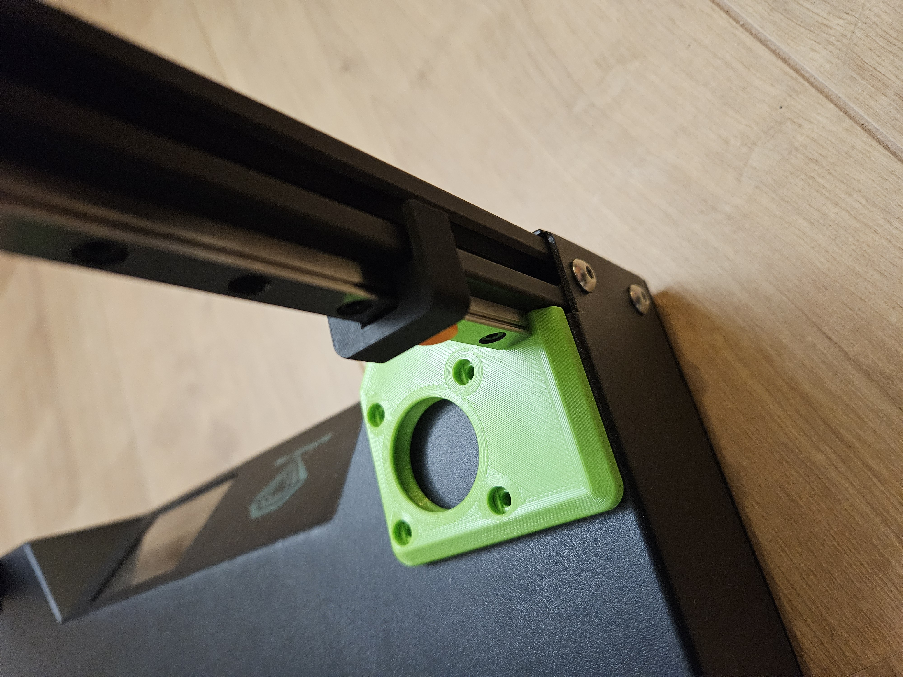

# Sapphire SP3 triple-z mod

## Align parts before drilling

First start to mount the new MGN9H 300mm rails.
To align them, i used an align tool.
Search on internet for a tool you like, for example: <a href="https://www.yeggi.com/q/mgn9+alignment/"Align MGN9H tool"

To make them square, i used aluminium tape. Just stick it on to rotate or tilt the extrusion profile, untill everything is square to each other

  

Go to the next step: <a href="../alignparts/readme.md">Align the new parts and check before drilling</a>
