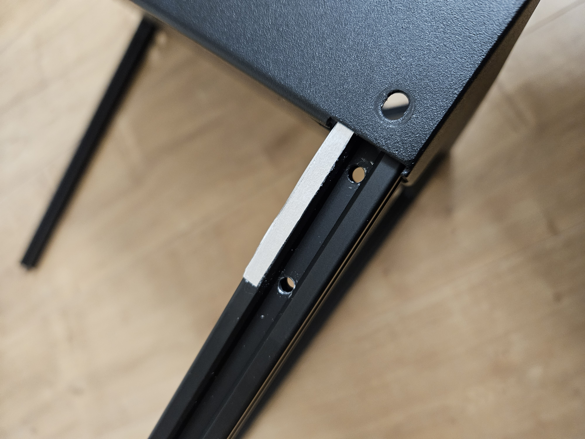

The base of the sapphire sp3 is a welded base.  
On my sp3 i noticed, that the extrusion profiles where not square to each other.

To make them square, i used aluminium tape. Just stick it on to rotate or tilt the extrusion profile, untill everything is square to each other

  

