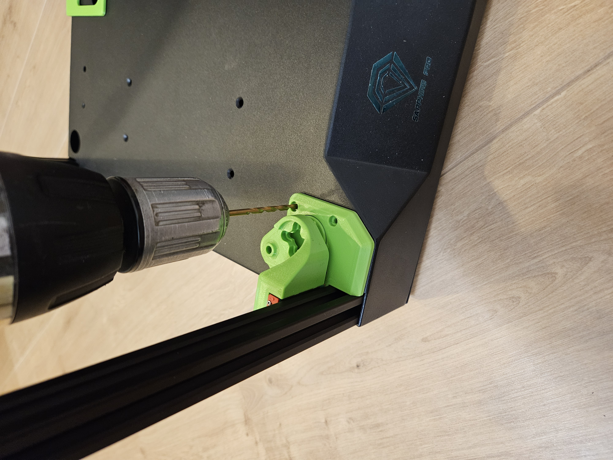
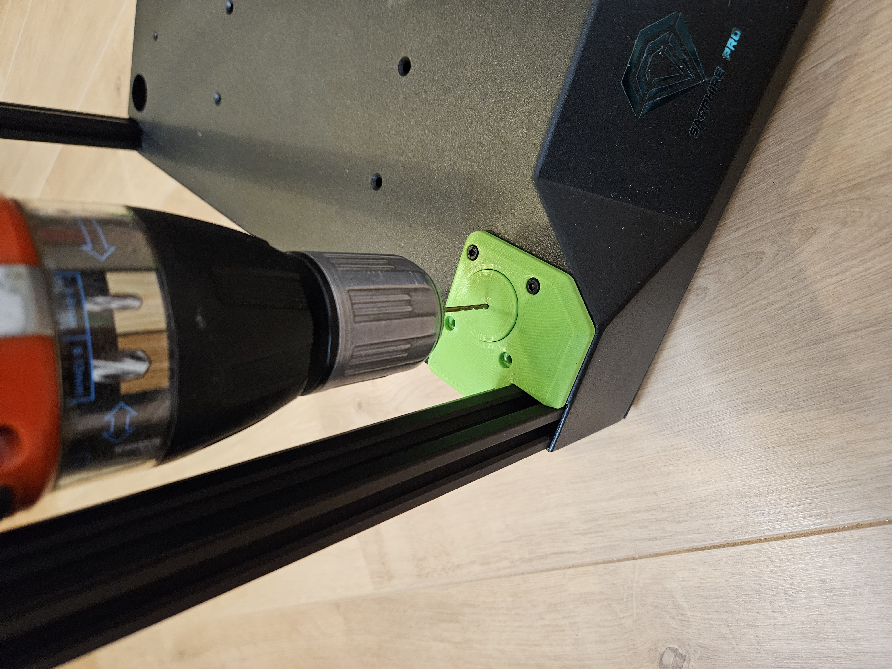
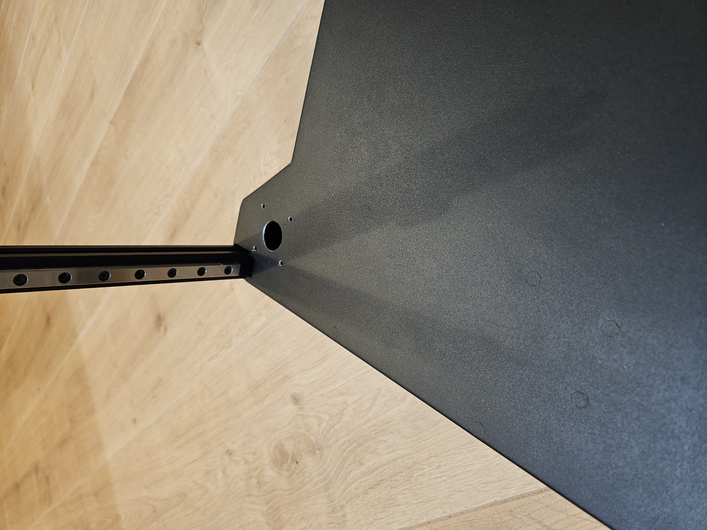
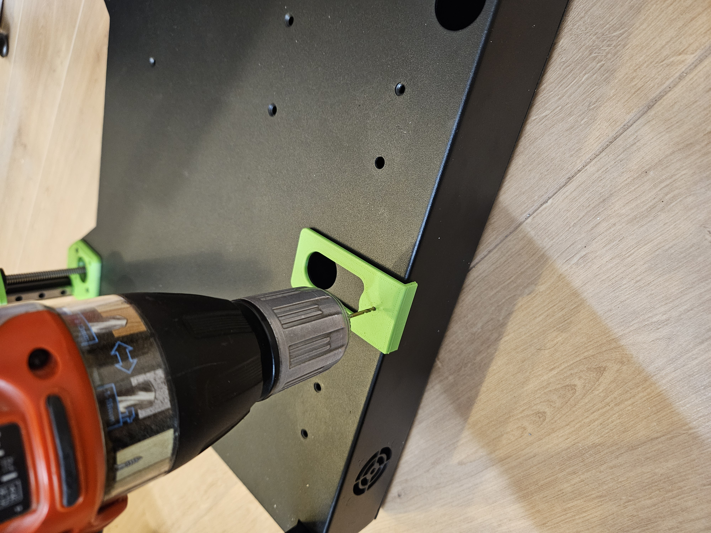

# Sapphire SP3 triple-z mod

## Drilling the holes in the base
Only do these steps, if you are sure the aligment is perfect.  

Start drilling the holes. Use the z-stepper plates as a jig.  
Drill only the 2 holes that are closed to the screen side.  

  

When the first 2 holes are done, place some screws in the holes, that the z-stepper plate will not move.  
Remove the z-carriage and drill use the jig to drill the hole for the spindle.  

  

The hole for the spindle has to be enlarged, that a thrust bearing can go tru the hole.  
On mine i made them 20mm diameter.  
This is how it looks, when all hole for the front steppes are done (1 side shown)

  

For the mounting the profile for the back extrusion, there is a drill jig made.  
This drill jig fits on the originale stepper holes.  

  

Go to the next step: <a href="../alignparts/readme.md">Align the new parts and check before drilling</a>
