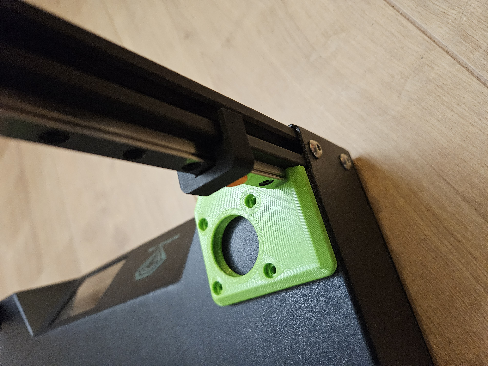

# Sapphire SP3 triple-z mod

## Align the new parts and check before drilling

First start to mount the new MGN9H 300mm rails. 
To align them, i used an align tool. 
Search on internet for a tool you like, for example: <a href="https://www.yeggi.com/q/mgn9+alignment/">Align MGN9H tool</a>

To mount the rail on the correct height, place correct z-stepper plate undernead.  
Keep aprox 1mm space between rail and z-stepper plate.

  

To check if everything is aligned, mount the z-carriage to the MGN9H. 
There is a round drill jig, place this jig in the z-stepper plate. 
If everything is correctly aligned, the small hole of the jig is in the middle of the space where the spindle will be mounted. 
If this is not the case, check you alignement, don't drill before this is solved.

  

Go to the next step: <a href="../drilling/readme.md">Drilling the holes in the base</a>
