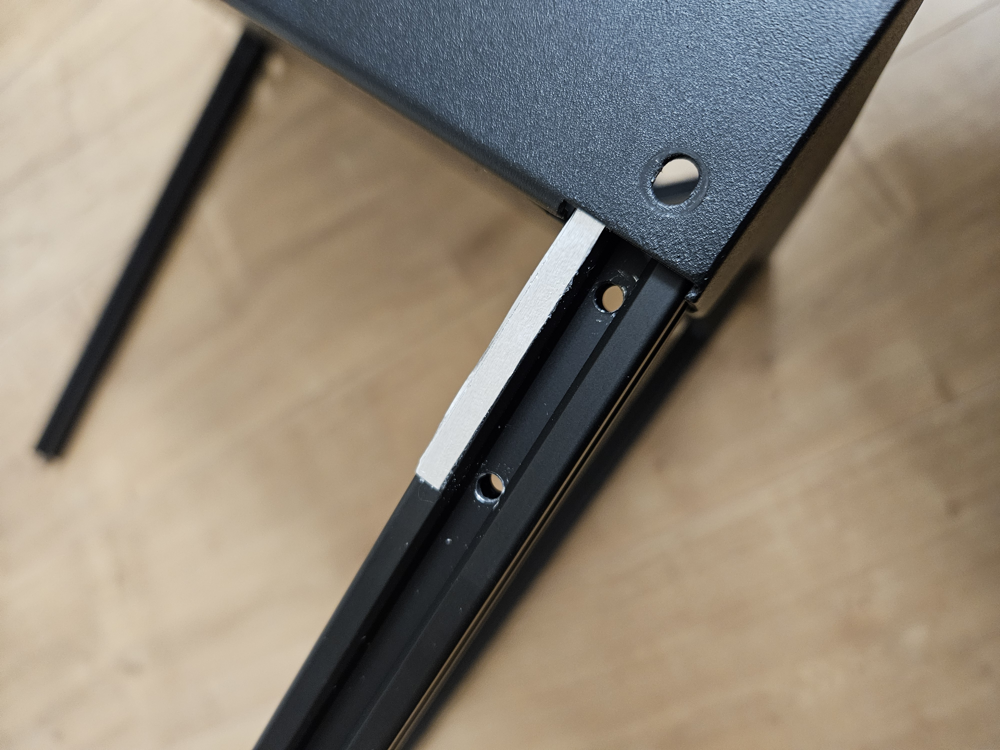
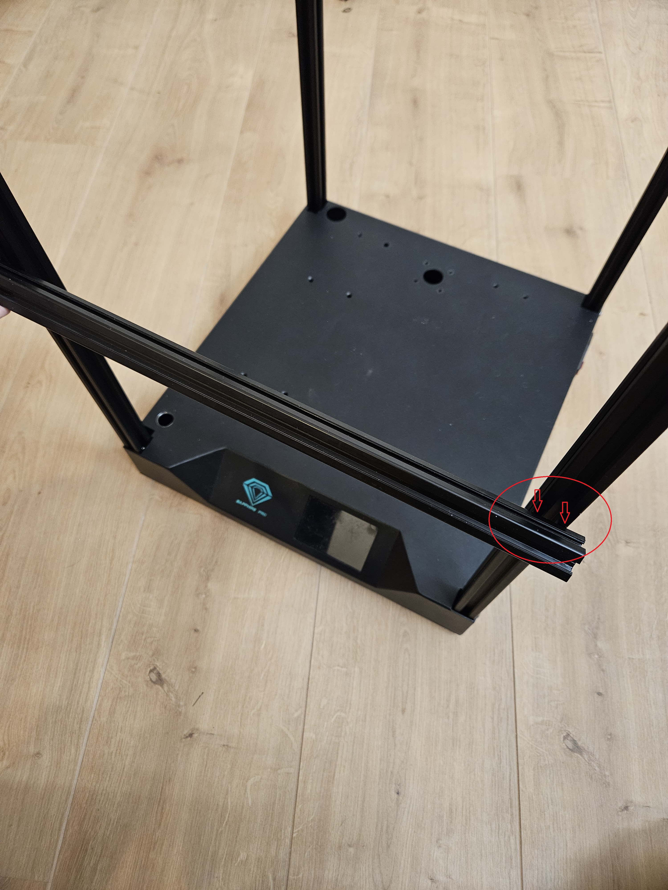

# Sapphire SP3 triple-z mod

## Align extrusion profiles that they are square
Needed for these steps:  
- aluminium tape  
- patience  

The base of the sapphire sp3 is a welded base.  
On my sp3 i noticed, that the extrusion profiles where not square to each other.

To make them square, i used aluminium tape. Just stick it on to rotate or tilt the extrusion profile, untill everything is square to each other

  

When everything is square, do another check, put a profile between the profile and see if it touches both profiles correctly.  
Like shown in the red cirkel, the 2 arrows. If everything is square, there where to arrows are, there isn't shining light between.  
If the test profile if not flush and there is light shining between the profiles, re-adjust everything.

  

Go to the next step: <a href="../step2_left-right_alignparts/readme.md">Front left and right new parts, check before drilling</a>
