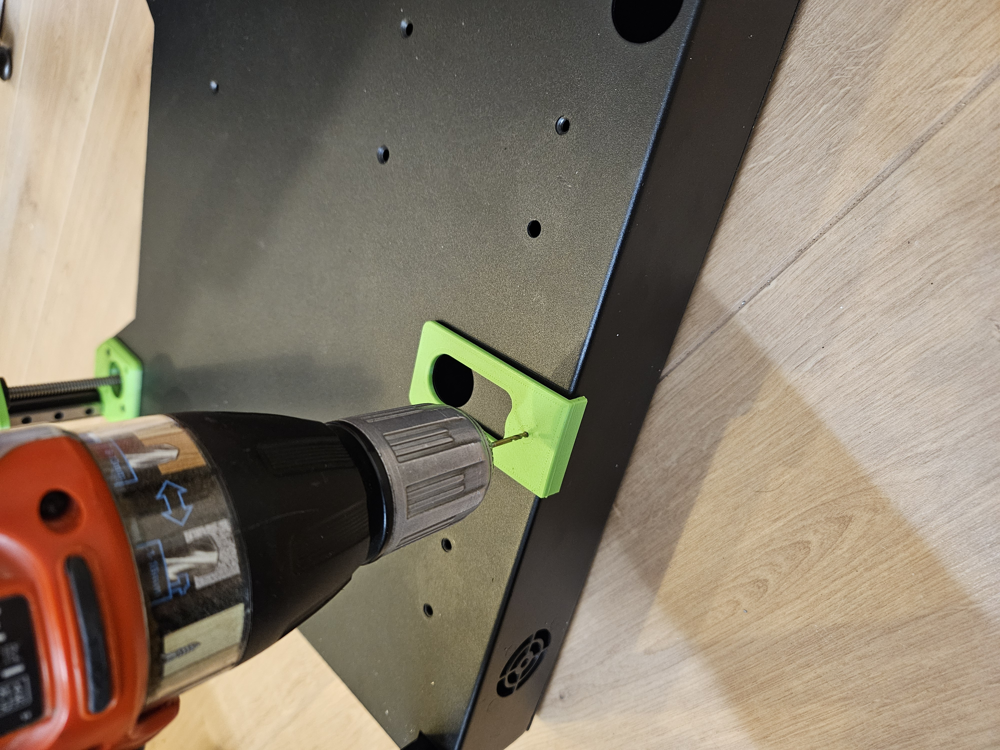

# Sapphire SP3 triple-z mod

## Rear profile position, drilling the holes in the base
Only do these steps, if you are sure the aligment is perfect.  

For the mounting the profile for the back extrusion, there is a drill jig made.  
This drill jig fits on the originale stepper holes. Only 1 hole in the base needs to be drilled for this step.  
Enlarge the hole to 6mm  

  

Go to the next step: <a href="../step5_mount_rear/readme.md">Mounting rear profile position</a>
