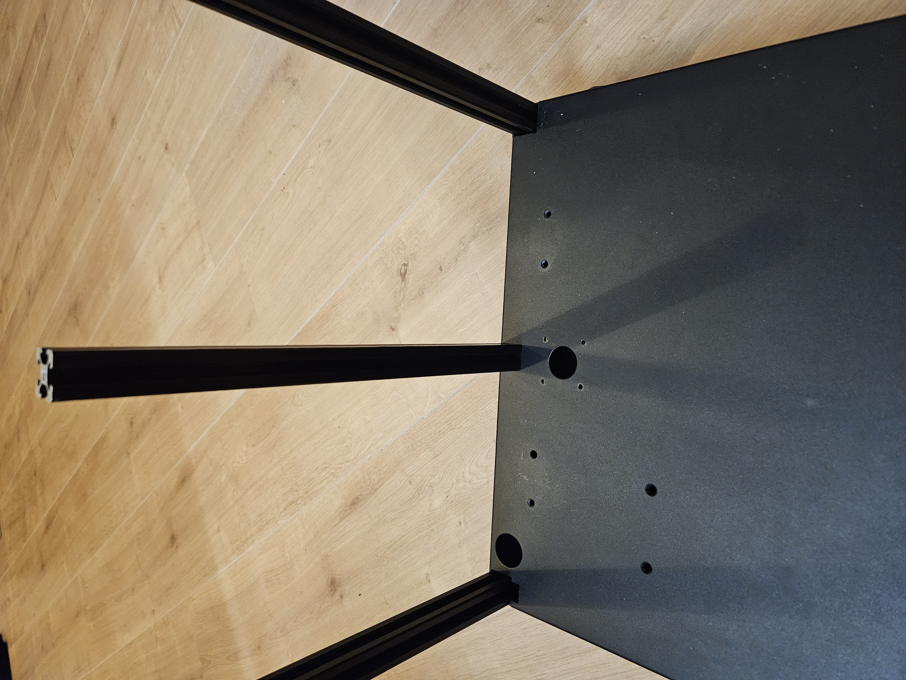
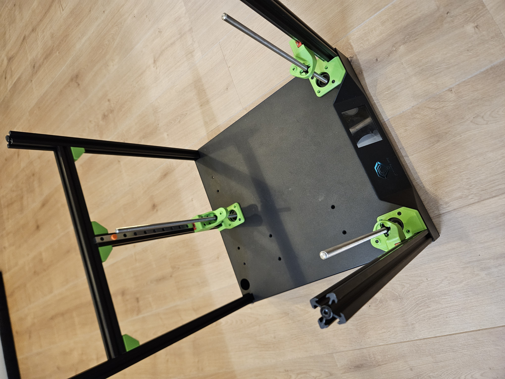

# Sapphire SP3 triple-z mod

## Mounting rear profile
Needed for these steps:  
1x 2020 profile 303,0mm long  
1x 2020 profile 334,5mm long  
1x SHDC m6x20mm screw  
1x m6 washer  
8x BHCS m5x10mm screw  
8x hammernut for 20 series - M5  

The 2020 profile has a 5mm hole on the side, make M6 thread in this profile.  
From the inside from the base, place the M6 screw in the fresh drilled hole. With a washer in between.  
Make sure, that your new profile is in line with the original back profiles.  
If you can't get it aligned propperly, then enlarge the hole in the base step by step, untill the profile is aligned.  

  

Place 2020 profile 334,5mm on top of the vertical profile and secure it 4x 2020 corner brackets 
Normally these bracket have a 5mm hole. Use M5 x 10mm screw and m5 hammernut, to mount the brackets  
<a href="../../.stl_files/corner_bracket">The 3d printed corner brackets can be found here</a>  
Be sure every is square mounted  

  

Go to the next step: <a href="../step6_steppermount/readme.md">Mounting stepper motors</a>
