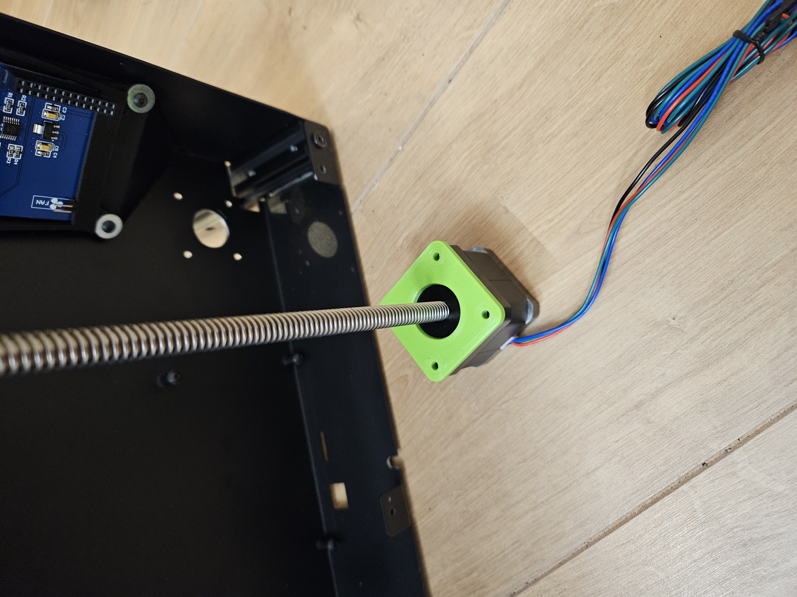
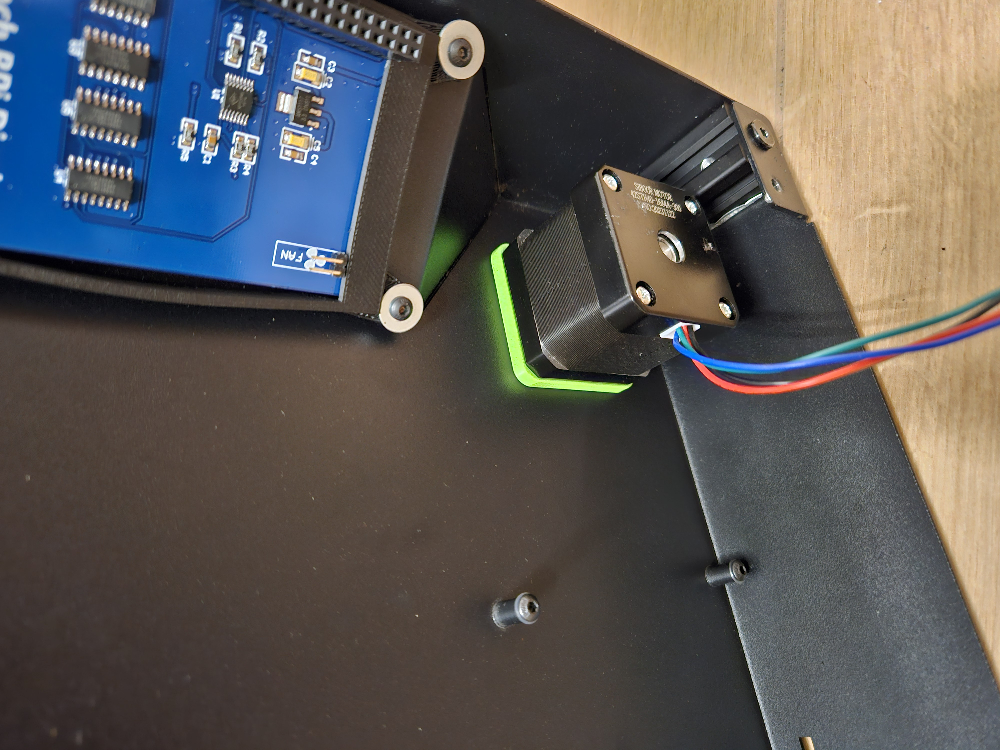
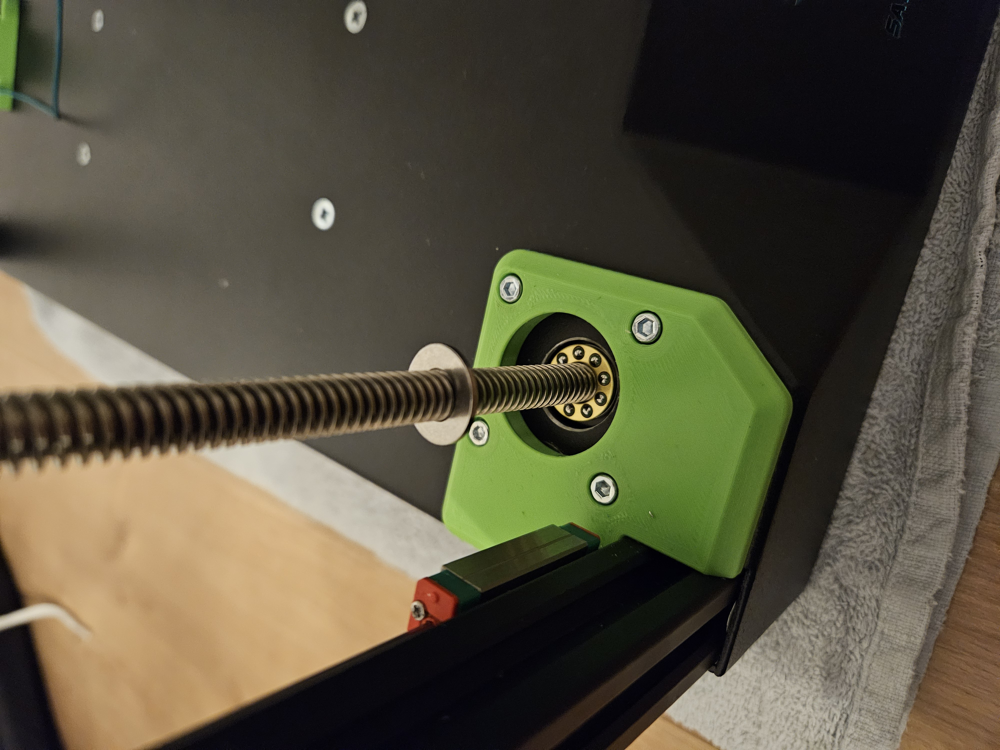
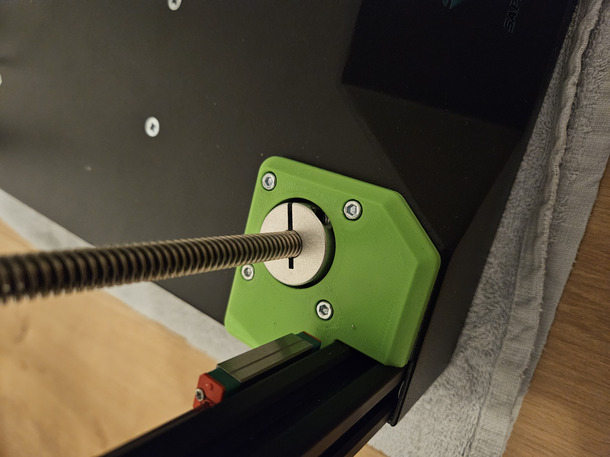

# Sapphire SP3 triple-z mod

## Mounting stepper motors
Needed for these steps:
- 12x SHDC m3x12mm screw
- 3x nema 17 stepper, tr8 x 300mm (spindle and stepper are 1 part)
- 3x POM Anti Backlash Nuts For Leadscrew (must fit your spindles)
- 3x thrust bearing F8-16M (8x16x5mm)
- 3x axis mounting ring (8x25x8mm)

Mounting the steppers can be a little tricky.  
I made the holes for the thrust bearing pretty small. That the axis mounting ring doesn't fit tru this hole.  
This was because i didn't want to make that large holes in the base.  

Start by putting the filler plate on the stepper.  

  

Place the stepper + filler plate in the correct position.  

  

The next pictures are a little confusion, because the z-stepper plate is already mounted, but don't do that.  
After placing the stepper in the correct position, first put the thrust bearing in place.  

  

Next, place the axis mounting ring in place.  
Push i good against the stepper and secure the axis mounting ring in place  
When everything is in place, mount fit the z-stepper plate over it and secure everything together with M3x16mm screws.  
Repeat these steps for the other stepper motors.  

  

