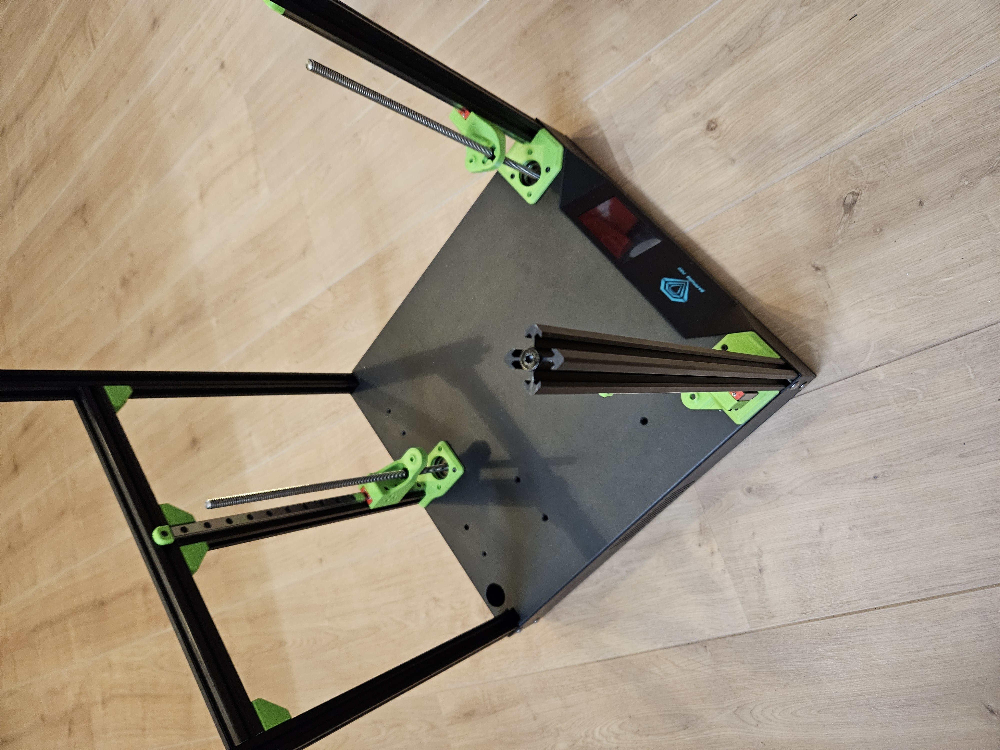

# Sapphire SP3 triple-z mod

## Mount rail carriages
Needed for these steps:  
- 8x SHDC m3x12mm screw  
- 4x SHDC m3x14mm screw  

Mount to the 3 rail carriages, the 3D printed parts.  
The parts in the front are mounted with SHDC M3x12 screws.  
The parts in the rear is mounted with SHDC M3x14 screws.  

  

