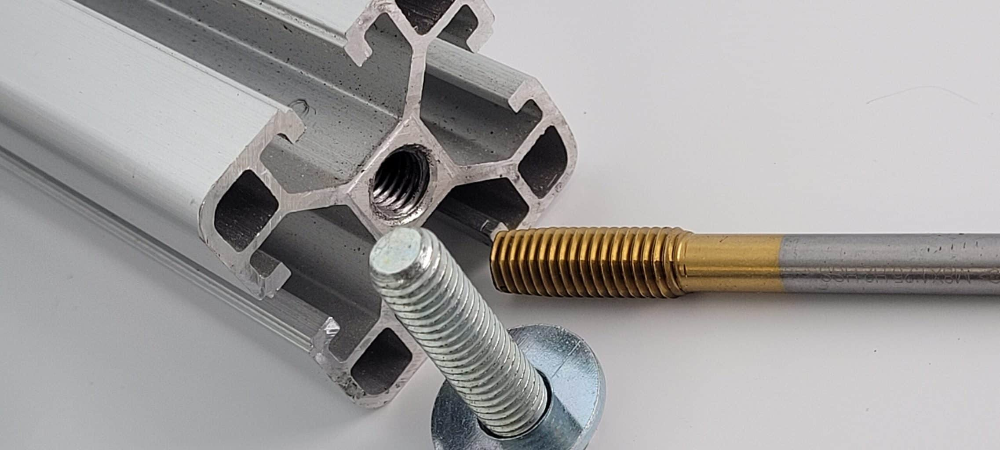
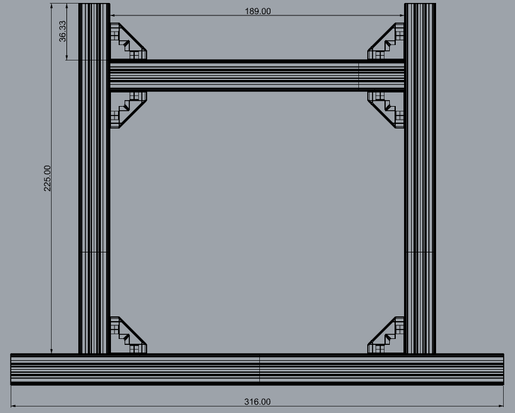
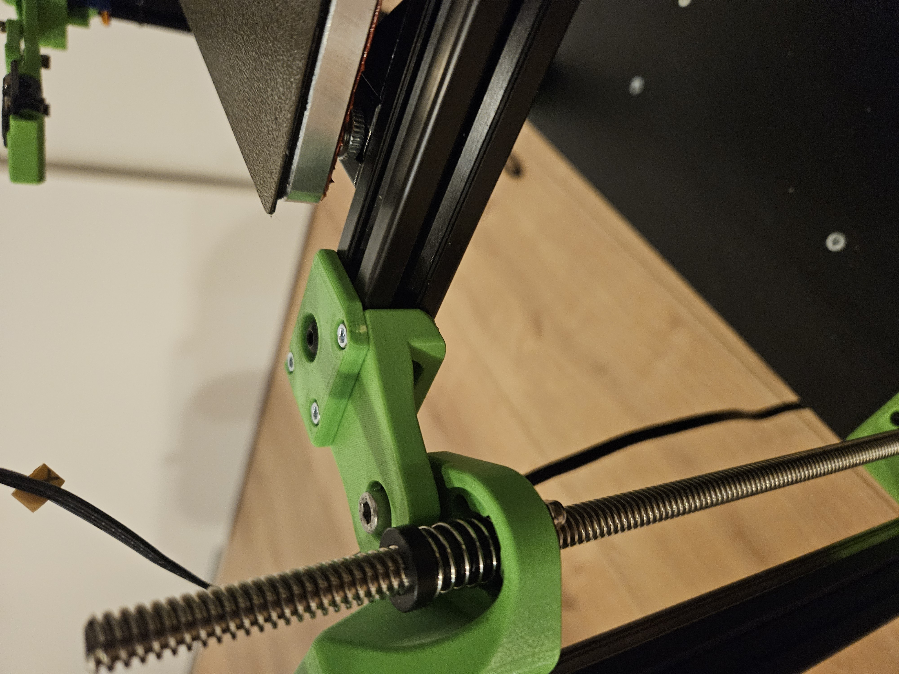

# Sapphire SP3 triple-z mod

## Making gantry
Needed for these steps:  
- 6x  BHCS m3x6mm screw  
- 6x SHDC m3x20mm screw  
- 16x BHCS m5x10mm screw  
- 2x  SHDC m6x20mm screw  
- 16x T-nut, spring loaded type for 20 series - M5  
- 6x Threaded inserts M3x5  
- 3x IGUS eglm05 (cheaper option: GE5C bearing)  
- 1x 2020 profile 316,0mm long  
- 2x 2020 profile 225,0mm long  
- 1x 2020 profile 189,0mm long  

Start with making M6 thread on both sides of the 316mm profile, +/- 20mm deep.

  

Assemble the parts, that it looks like this picture.  
These are the sizes for mounting a bed which has hole spacing 209x209mm.  
If you have hole spacing 170x170mm, then the 189,0mm profile has to be changed to 150,0mm long.  
The brackets shown, are the minimum brackets which needs to be mounted.  

  

Prep the 3d parts, which needs to be mounted to the sides of the 316mm profile.  
Start with placing the threaded inserts in the bottom of the main part. Take your time doing this, the wall is thin.  
After that place the top plate on the main part with 3x M3x20mm.  
Place the IGUS eglm05 in it hole and secure it with 3x m3x6, be carefull with these screws, they tap there on thread when mounting.  
Align the assebled part on the profile and start with the M6x20 screw on the side. Do not fully tighten.  
Place the spring loaded M5 nuts and M5 screws in place. Align everything to the profile and tighten the screws.  

The 316mm profile is on the save side, that the length had the be a little longer.  
Therefor there are 2020 profile spacers in the .stl folder. How much needed depends on your printer.  
https://github.com/Hoeby/Sapphire/tree/main/triple-z_mod/.stl_files/2020_profile_spacers

  
  

