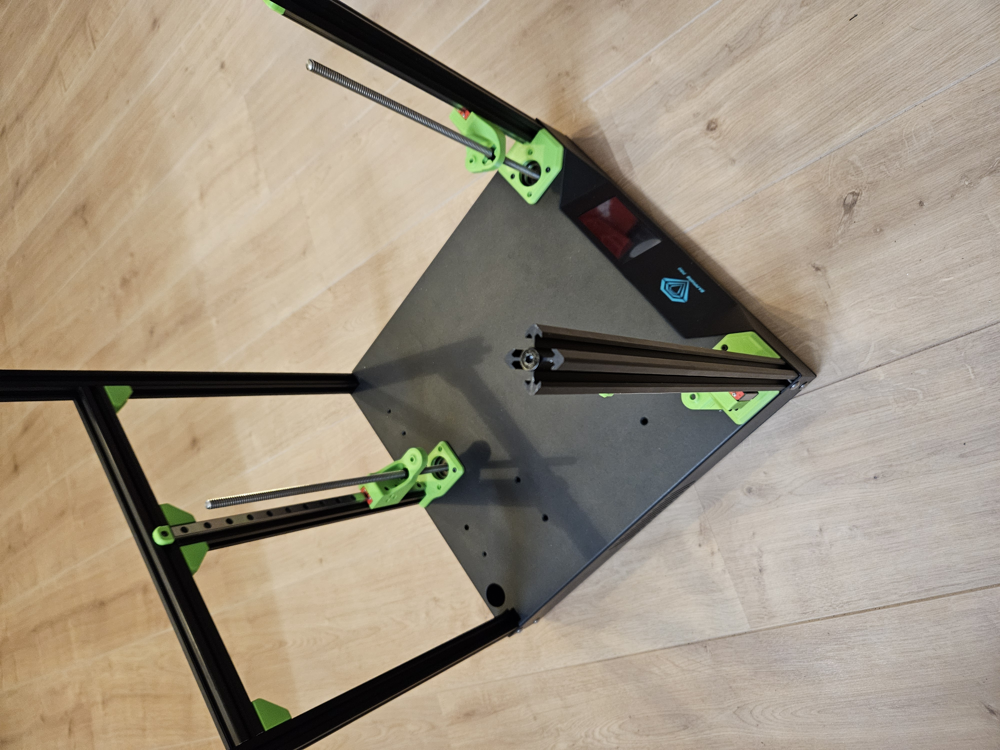

# Sapphire SP3 triple-z mod

## Making gantry
Needed for these steps:  
- 12x BHCS m5x10mm screw  
- 12x T-nut, spring loaded type for 20 series - M5  
- 1x 2020 profile 316,0mm long  
- 2x 2020 profile 225,0mm long  
- 1x 2020 profile 189,0mm long  

  

Go to the next step: <a href="../step8_gantry/readme.md">Making Gantry</a>
