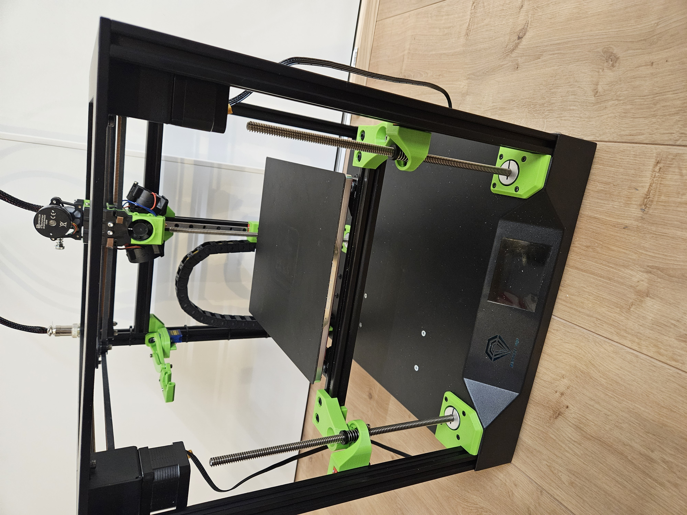

For changing the sapphire SP3 to triple z, i tried to explain every step  
Some parts in the pictures could look different, because i am still fine tuning parts.  

  

# Index:
- <a href="assets/step1_checksquare/readme.md">Align extrusion profiles that they are square</a>
- <a href="assets/step2_left-right_alignparts/readme.md">Front left and right new parts, check before drilling</a>
- <a href="assets/step3_left-right_drilling/readme.md">Front left and right, drilling the holes in the base</a>
- <a href="assets/step4_rear_drilling/readme.md">Rear profile position, drilling the holes in the base</a>
- <a href="assets/step5_mount_rear/readme.md">Mounting rear profile</a>
- <a href="assets/step6_steppermount/readme.md">Mounting stepper motors</a>
- <a href="assets/step7_mount_carriages/readme.md">Mount rail carriages</a>

## BOM list:
3x  MGN9H linear rail, 300mm long  
3x  nema 17 stepper, tr8 x 300mm (spindle and stepper are 1 part)  
3x  POM Anti Backlash Nuts For Leadscrew (must fit your spindles)  
3x  thrust bearing F8-16M (8x16x5mm)  
3x  axis mounting ring (8x25x8mm)  
24x SHDC m3x8mm screw  
20x  SHDC m3x12mm screw  
4x  SHDC m3x14mm screw  
12x SHDC m3x16mm screw  
1x  SHDC m6x20mm screw  
8x  BHCS m5x10mm screw  
1x  m6 washer  
24x T-nut, spring loaded type for 20 series - M3  
8x hammernut for 20 series - M5  

### Profiles BOM list:
1x 2020 profile 303,0mm long  
1x 2020 profile 334,5mm long  
1x 2020 profile 316,0mm long  
2x 2020 profile 225,0mm long  
1x 2020 profile 189,0mm long  
